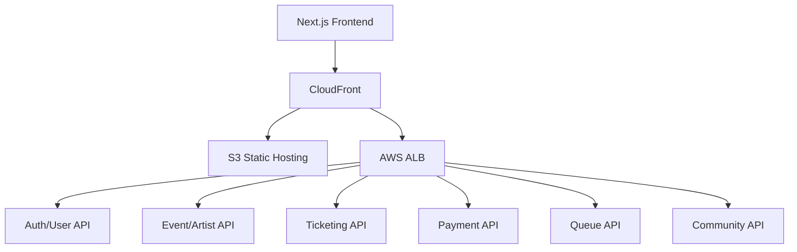

# URR 우르르

K-POP 팬덤을 위한 공정 티켓팅 플랫폼 프론트엔드입니다.  
팬 활동 기반 멤버십 등급으로 예매 우선권을 차등 제공하고, 티켓 예매부터 양도, 커뮤니티까지 하나의 서비스 흐름으로 연결합니다.

> 이 저장소는 협업 프로젝트를 포트폴리오용 프론트엔드 데모로 전환한 버전입니다.  
> 백엔드 서버 없이도 주요 조회, 예매, 결제 데모 플로우를 확인할 수 있도록 mock 데이터 기반으로 동작합니다.

| 항목 | 내용 |
| --- | --- |
| 프로젝트 유형 | 팀 프로젝트 기반 개인 포트폴리오 리팩터링 |
| 주요 역할 | Next.js 마이그레이션, 인증 흐름, 예매 상태머신, mock 전환, UI 플로우 안정화 |
| 협업 레포지토리 | [KTCloud-TechUp/urr-frontend](https://github.com/KTCloud-TechUp/urr-frontend) |
| 포트폴리오 레포지토리 | [kkaengji/urr-frontend](https://github.com/kkaengji/urr-frontend) |
| 라이브 데모 | [https://urr-frontend.vercel.app/landing](https://urr-frontend.vercel.app/landing) |

---

## 목차

- [프로젝트 개요](#프로젝트-개요)
- [기술 스택](#기술-스택)
- [핵심 구현](#핵심-구현)
- [아키텍처](#아키텍처)
- [주요 화면](#주요-화면)
- [트러블슈팅](#트러블슈팅)
- [로컬 실행](#로컬-실행)
- [문서](#문서)

---

## 프로젝트 개요

### 문제 정의

기존 티켓팅 서비스는 인기 공연일수록 매크로, 봇, 비정상 대기열 점유 문제가 커지고, 실제 팬 활동을 오래 해온 사용자가 공정하게 예매 기회를 얻기 어렵습니다.

URR은 팬 활동 점수를 기반으로 멤버십 등급을 나누고, 등급별 예매 진입 시간과 수수료 정책을 다르게 적용하는 방식으로 공정성을 높이는 티켓팅 플랫폼을 목표로 합니다.

### 서비스 흐름

```text
아티스트 탐색
  -> 멤버십 가입
  -> 등급별 예매 대기열
  -> 좌석/구역/회차 선택
  -> 결제
  -> 티켓 확인
  -> 양도 또는 커뮤니티 활동
```

### 포트폴리오 전환 방향

초기 프로젝트는 프론트엔드, Spring Boot 백엔드, AWS 인프라를 함께 운영한 팀 프로젝트였습니다. 현재 저장소는 백엔드 서버 종료 이후에도 서비스의 주요 경험을 직접 확인할 수 있도록 프론트엔드 단독 데모로 재구성했습니다.

- 주요 화면과 예매 플로우는 mock 데이터로 동작
- TanStack Query 기반 API 계층은 유지해 실 API 재연동 가능
- OAuth, 문자 인증, 회원 탈퇴 등 일부 API 연동 코드는 재연동을 위해 보존
- 끊겨 있던 예매, 결제, 완료 흐름을 포트폴리오 데모 기준으로 복원

---

## 기술 스택

| 분야 | 기술 |
| --- | --- |
| Framework | Next.js 16 App Router |
| Language | TypeScript strict |
| UI | React 19, shadcn/ui, Radix UI, lucide-react |
| Styling | Tailwind CSS v4 |
| Server State | TanStack Query v5 |
| Client State | Zustand |
| Payment | Toss Payments SDK, 데모 결제 fallback |
| Visualization | Three.js, QRCode |
| Quality | ESLint, TypeScript, Husky |

### 선택 이유

**Next.js App Router**  
페이지 레이아웃 예외, 인증 콜백, 결제 확인 Route Handler를 한 구조 안에서 관리하기 위해 사용했습니다. Vite 프로토타입을 Next.js로 마이그레이션하며 라우팅과 페이지 책임을 명확히 분리했습니다.

**TanStack Query**  
공연, 좌석, 대기열, 결제 상태처럼 서버 데이터 성격이 강한 상태를 캐싱과 refetch 정책으로 관리했습니다. mock 전환 후에도 API 함수 경계를 유지해 실제 서버 재연동 비용을 줄였습니다.

**Zustand**  
예매처럼 여러 단계와 페이지 이동을 통과하는 클라이언트 상태만 전역 store로 관리했습니다. 모달, 탭, 폼 입력 같은 단순 UI 상태는 컴포넌트 내부 상태로 제한했습니다.

**Feature-Sliced Design**  
페이지, 기능, 도메인, 공용 모듈의 책임을 분리해 협업 중 충돌을 줄이고, 포트폴리오 전환 시 mock 데이터 교체 범위를 좁혔습니다.

---

## 핵심 구현

### 1. 예매 상태머신

예매는 단순한 페이지 이동이 아니라 대기열, 좌석 선택, 결제, 실패 복구, 완료가 연결된 상태 흐름입니다. 이를 Zustand store와 guard 컴포넌트로 분리해 직접 URL 접근, 새로고침, 이전 페이지 effect 간섭을 제어했습니다.

```text
idle
  -> queue
  -> seats-section
  -> seats-individual
  -> payment
  -> confirmation

seats-individual
  -> seats-expired
  -> seats-section

payment
  -> payment-failed
  -> payment
```

구현 포인트:

- 예매 페이지 직접 접근 차단
- 대기열 통과 후에만 예매 화면 진입 허용
- 좌석 선택 시간 만료 시 이전 단계로 복귀
- 결제 실패 시 재시도 플로우 제공
- `sessionStorage`를 이용해 라우팅 직후 시작 phase 전달

### 2. 공연 유형별 예매 플로우 분기

공연 카테고리에 따라 같은 좌석도 방식이 아니라 다른 선택 UI가 필요합니다. 공통 예매 컨텍스트 안에서 flow type을 분리해 콘서트, 페스티벌, 뮤지컬/전시 플로우를 각각 처리했습니다.

| 유형 | 대상 | 예매 흐름 |
| --- | --- | --- |
| 좌석도형 | 콘서트, 팬미팅, 내한 공연 | 구역 선택 -> 개별 좌석 선택 -> 결제 |
| 구역형 | 페스티벌 | 구역 카드 선택 -> 수량 선택 -> 결제 |
| 회차형 | 뮤지컬, 전시 | 날짜/회차 선택 -> 등급 선택 -> 결제 |

### 3. 인증 토큰 관리와 401 재발급 흐름

협업 버전에서는 JWT 기반 인증 구조를 구현했습니다. Access Token은 메모리에서 관리하고, Refresh Token은 httpOnly 쿠키로 전송하는 구조입니다.

```text
API 요청
  -> Authorization 헤더 주입
  -> 401 응답 감지
  -> refresh token으로 access token 재발급
  -> 원본 요청 재시도
  -> 재발급 실패 시 로그아웃 처리
```

S3 정적 배포 환경에서는 OAuth 콜백 이후 full page reload로 메모리 토큰이 사라지는 문제가 있어 `sessionStorage` 백업 계층을 추가했습니다. 현재 포트폴리오 버전은 mock 로그인으로 동작하지만, 인증 클라이언트 구조는 재연동 가능하도록 유지했습니다.

### 4. 프론트엔드 단독 데모 전환

백엔드 서버가 내려간 뒤에도 실제로 눌러볼 수 있는 포트폴리오를 만들기 위해 주요 API 응답을 mock fixture로 전환했습니다.

- 이벤트 18개, 아티스트 5개, 라이트닝 등급 mock user 구성
- 로그인, 회원가입, 내 정보 조회, 로그아웃 mock 처리
- 예매, 결제 완료, 티켓 확인 플로우 유지
- 실 API 호출 위치는 `features/<domain>/api` 경계 안에 보존

---

## 아키텍처

### 디렉터리 구조

```text
src/
├── app/        # Next.js 라우팅 진입점
├── widgets/    # 페이지를 구성하는 큰 UI 블록
├── features/   # 사용자 행동 단위
├── entities/   # 도메인 타입과 표현 컴포넌트
└── shared/     # 공용 API, lib, UI, 타입
```

레이어 import 방향은 아래 규칙을 따릅니다.

```text
app -> widgets -> features -> entities -> shared
```

### API 계층

```text
features/<domain>/api
  -> shared/api/client.ts
  -> shared/api/interceptor.ts
  -> shared/api/tokenStore.ts
```

컴포넌트에서 `apiRequest()`를 직접 호출하지 않고, feature별 API 함수를 통해 접근하도록 구성했습니다. 이 구조 덕분에 mock 데이터와 실 API 전환 범위를 API 계층 내부로 제한할 수 있습니다.

### 협업 당시 시스템 구조



현재 포트폴리오 버전은 Vercel 배포와 mock 데이터를 기준으로 동작합니다.

---

## 주요 화면

| 경로 | 화면 |
| --- | --- |
| `/` | 홈 |
| `/landing` | 서비스 소개 |
| `/artists` | 아티스트 목록 |
| `/artists/:artistId` | 아티스트 상세, 멤버십 게이트 |
| `/events` | 공연 목록 |
| `/events/:eventId` | 공연 상세 |
| `/events/:eventId/booking` | 예매 플로우 |
| `/booking/complete` | 예매 완료 |
| `/membership` | 멤버십 가입 |
| `/my-page` | 마이페이지 |
| `/onboarding` | 로그인/회원가입 |
| `/search` | 통합 검색 |
| `/notifications` | 알림 |
| `/tickets/:reservationId` | 티켓 상세 |
| `/transfer/:artistId/:listingId` | 양도 상세 |

---

## 트러블슈팅

### OAuth 콜백 후 인증 토큰 유실

**문제**  
S3 + CloudFront 정적 배포 환경에서 소셜 로그인 콜백 후 다음 페이지로 이동하면 본인인증 API가 403을 반환했습니다. 로컬 SPA 환경에서는 재현되지 않았습니다.

**원인**  
CloudFront가 새 HTML을 다시 로드하면서 JS 메모리에 있던 Access Token이 초기화되었습니다.

**해결**  
Access Token을 메모리에 우선 저장하되, 정적 배포 환경의 full page reload를 견디기 위해 `sessionStorage` 백업을 추가했습니다.

**결과**  
OAuth 콜백 이후에도 인증 상태가 유지되었고, 본인인증 단계로 정상 진입했습니다. XSS 노출 면적 증가라는 트레이드오프는 Access Token 짧은 만료 시간과 Refresh Token httpOnly 쿠키 정책으로 관리했습니다.

### 예매 페이지 진입 직후 상세 페이지로 되돌아가는 문제

**문제**  
대기열 통과 후 예매 페이지로 이동해야 하지만, 모달이 잠깐 보인 뒤 공연 상세 페이지로 돌아가는 현상이 있었습니다.

**원인**  
대기열 통과 핸들러에서 예매 store를 reset하는 순간, 아직 언마운트되지 않은 공연 상세 페이지의 effect가 먼저 실행되어 예매 시작 키를 소비했습니다. 이후 실제 예매 페이지 guard는 필요한 키를 찾지 못해 상세 페이지로 redirect했습니다.

**해결**  
대기열 통과 핸들러에서는 시작 phase만 저장하고, store 초기화는 예매 페이지의 `BookingGuard`가 진입을 허용하는 시점에 수행하도록 책임을 옮겼습니다.

**결과**  
이전 페이지 effect가 예매 시작 키를 가로채지 않게 되었고, 대기열 통과 후 예매 페이지 진입이 안정화되었습니다.

---

## 로컬 실행

### 요구 사항

- Node.js 24 이상
- npm

### 설치 및 실행

```bash
npm install
npm run dev
```

개발 서버는 기본적으로 `http://localhost:3000`에서 실행됩니다.

### 검증

```bash
npm run lint
npm run type-check
npm run build
```

주요 화면과 예매 데모는 mock 데이터로 동작합니다. 소셜 콜백, 문자 인증, 회원 탈퇴처럼 실제 서버 연동을 전제로 남겨둔 일부 기능은 백엔드 서버 없이는 정상 동작하지 않을 수 있습니다.

---

## 문서

| 문서 | 내용 |
| --- | --- |
| [docs/CheckList.md](docs/CheckList.md) | 포트폴리오 전환 진행 현황 |
| [docs/designsystem.md](docs/designsystem.md) | 디자인 시스템 |
| [docs/user_flow.md](docs/user_flow.md) | 사용자 플로우 |
| [docs/PRD.md](docs/PRD.md) | 제품 요구사항 |
| [docs/TROUBLESHOOTING.md](docs/TROUBLESHOOTING.md) | 문제 해결 기록 |
| [AGENTS.md](AGENTS.md) | AI 작업 가이드 |
