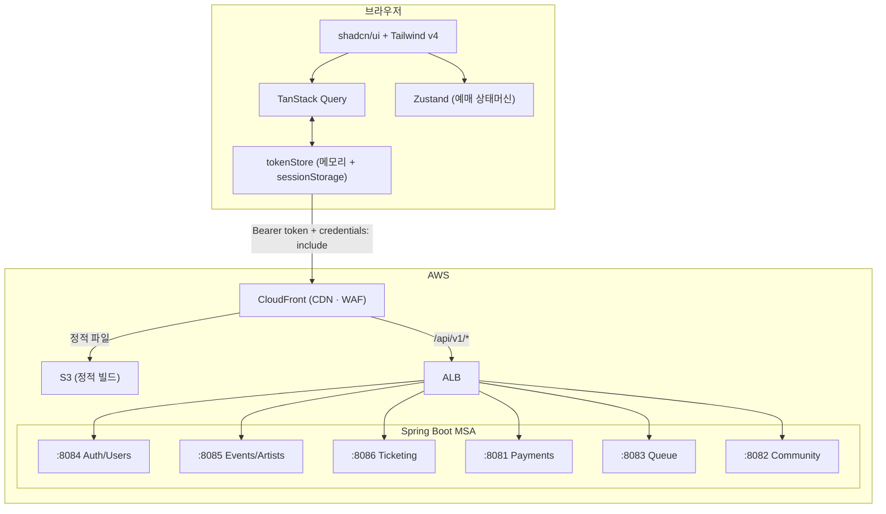

# URR (우르르)

> K-POP 찐팬을 위한 공정 티켓팅 플랫폼

**매크로·봇이 점령한 대기열** 문제를 해결하기 위해, 팬 활동 점수 기반 멤버십 등급으로 티켓 우선권을 차등 부여하는 공정 티켓팅 서비스입니다.  
티켓 예매 → 양도 → 팬 커뮤니티를 단일 플랫폼으로 통합합니다.

**15명 팀 · 약 10주**

|---|---|
| 연동 API | 45개 엔드포인트 |
| 개발 페이지 | 10개 라우트 |
| 머지 PR | 49회 |

---

## 핵심 요약

- **Next.js 16** 기반 티켓팅 플랫폼 프론트엔드 단독 개발 (Vite 프로토타입 → Next.js 마이그레이션 포함)
- 실시간 예매 플로우 및 상태머신 설계 (Zustand + sessionStorage 기반 페이지 이동 제어)
- JWT 인증 + 401 자동 재발급 인터셉터 구현 (httpOnly 쿠키 + 메모리 토큰)
- S3 정적 배포 환경에서 **OAuth 콜백 토큰 유실 문제** 발견 및 해결 (sessionStorage 백업)
- FSD(Feature-Sliced Design) 아키텍처로 AI 에이전트 병렬 개발 워크플로우 구성

---

## 목차

1. [기술 스택](#기술-스택)
2. [핵심 구현](#핵심-구현)
3. [아키텍처](#아키텍처)
4. [트러블슈팅](#트러블슈팅)
5. [화면 구성](#화면-구성)
6. [로컬 실행](#로컬-실행)
7. [회고](#회고)

---

## 기술 스택

| 분야         | 기술                    | 선택 이유                                           |
| ------------ | ----------------------- | --------------------------------------------------- |
| Framework    | Next.js 16 (App Router) | 서버-클라이언트 경계 명확화 + 파일 기반 중첩 라우팅 |
| Language     | TypeScript (strict)     | 도메인 타입 안전성                                  |
| Styling      | Tailwind CSS v4         | 디자인 토큰 기반 스타일링                           |
| UI           | shadcn/ui (Radix UI)    | 접근성 준수 + 커스터마이징 자유도                   |
| Server State | TanStack Query v5       | API 캐싱 / 401 재시도 / 낙관적 업데이트             |
| Client State | Zustand                 | 여러 라우트에 걸친 예매 상태머신 관리               |

### 기술 선택 이유

**Next.js** — 멤버십 게이트, 대기열 인증 등 서버-클라이언트 경계가 명확하기 때문입니다. 서버 컴포넌트로 민감한 토큰 검증을 클라이언트에 노출시키지 않고, API 요청을 서버에서 직접 처리할 수 있습니다. 대기열 페이지 같은 정적 자산은 정적 생성으로 S3 배포 시 즉시 응답하게 설계했습니다.

**TypeScript** — 결제·예약 같은 금융 거래에는 타입 안정성이 필수입니다. IDE에서 API 응답 구조를 자동 보완하므로 개발 속도도 빠릅니다. 특히 복잡한 좌석 데이터 구조를 다룰 때 타입 미스매치를 컴파일 단계에서 잡을 수 있습니다.

**TanStack Query** — 2-Panel 예매 구조에서는 공연 정보, 대기열 상태, 좌석 정보가 실시간으로 동기화되어야 합니다. 자동 refetch·폴링·낙관적 업데이트를 조합하면 Redux 같은 복잡한 상태 관리 없이도 백엔드 데이터를 항상 최신으로 유지할 수 있습니다.

**Zustand** — 최소한만 사용합니다. 멤버십 가입 플로우처럼 4단계를 거쳐야 하는 경우 각 단계 사이 클라이언트 상태를 유지하고, 모달 열림/닫힘·탭 선택 같은 서버 상태와 무관한 UI 상태를 관리해 불필요한 API 호출을 줄입니다.

> **auth에 Zustand를 사용하지 않은 이유**: 인증 토큰은 React 렌더링 사이클 밖(API 인터셉터)에서도 읽어야 합니다. Zustand store는 React 트리 안에서만 접근 가능하므로, 인터셉터가 직접 읽을 수 있는 module-level 변수(`tokenStore.ts`)로 분리했습니다.

**Tailwind CSS + shadcn/ui** — Tailwind는 빠른 UI 구현을 가능하게 하고, shadcn/ui는 접근성 표준을 준수한 컴포넌트를 제공합니다. 대기열 모달·좌석 선택 그리드 같은 복잡한 UI에서 키보드 네비게이션과 스크린 리더 지원이 자동으로 보장됩니다.

---

## 핵심 구현

### 예매 플로우 — 상태머신

```
idle → queue → seats-section → seats-individual → payment → confirmation
                                     ↓ 3분 타임아웃      ↘ payment-failed
                               seats-expired → seats-section 복귀
```

- **대기열**: 순번 대기 UI (3초 갱신, 현재 시뮬레이션). 멤버십 등급별 입장 시각 차등.
- **좌석 선택**: SVG 기반 인터랙티브 좌석도. 등급·가격·잔여 상태 색상 표시.
- **페이지 간 상태 보호**: sessionStorage 키(`urr:booking:startPhase`)로 예매 페이지 직접 URL 접근 차단. `BookingGuard`가 키 유효성 확인 후 `reset()` 호출.

### 인증 전략 — JWT + httpOnly 쿠키

```
Access Token  — JS 메모리 우선 + sessionStorage 백업 (S3 정적 배포 제약)
Refresh Token — httpOnly 쿠키 (JS 접근 불가, 브라우저 자동 전송)
```

- 모든 API 요청에 `Authorization: Bearer` 헤더 자동 주입
- 401 감지 → `POST /api/auth/token/reissue` → 성공 시 원본 요청 재시도 / 실패 시 로그아웃
- **sessionStorage 백업**: S3+CloudFront 환경에서 full page reload 시 JS 메모리 초기화 문제 대응. SSR 전환 시 제거 가능.

### Vite 프로토타입 → Next.js 마이그레이션

디자인팀 프로토타입(flat 구조, mock 데이터 혼재)을 FSD 아키텍처로 재구성했습니다.

| 항목         | Before          | After                    |
| ------------ | --------------- | ------------------------ |
| Framework    | React (Vite)    | Next.js 16 (App Router)  |
| Architecture | Flat 구조       | FSD (레이어 import 규칙) |
| State        | `useState` 중심 | TanStack Query + Zustand |

**핵심 원칙**: 디자인 1:1 유지. Tailwind 클래스·레이아웃·색상은 Next.js 문법(`Link`, `useRouter`, `public/` 경로)으로만 교체.  
**결과**: `features/<domain>/api/` 파일만 수정하면 mock → 실 API 전환 완료. FSD 단방향 import 규칙이 AI 에이전트 병렬 작업 시 코드 충돌 방지에 직접 기여.

---

## 아키텍처

### 시스템 구조



> 현재 S3 정적 배포. SSR 적용 시 sessionStorage 백업 제거 가능.

### Feature-Sliced Design (FSD)

```
src/
├── app/        # Next.js 라우팅 진입점 (로직 없음)
├── widgets/    # 페이지 단위 UI 블록
├── features/   # 사용자 행동 단위 (feature 간 직접 import 금지)
├── entities/   # 도메인 모델
└── shared/     # api/, lib/, ui/
```

레이어 규칙: `app → widgets → features → entities → shared` 단방향만 허용.

```
features/<domain>/
├── ui/       # React 컴포넌트
├── model/    # Custom hooks · 상태 로직
├── api/      # API 요청 함수
└── index.ts  # public API
```

---

## 트러블슈팅

### 1. S3 정적 배포 — OAuth 콜백 토큰 유실 (403 에러)

**현상**: 카카오 소셜 로그인 완료 후 본인인증 API 요청이 403 반환. 로컬에서는 정상.

**원인**: OAuth 콜백 후 `/onboarding?step=identity`로 이동 시 CloudFront가 새 HTML 파일을 로드 → full page reload → JS 메모리 초기화 → 방금 저장한 Access Token 소멸.

**해결**: `tokenStore`에 sessionStorage 백업 계층 추가.

```ts
// tokenStore.ts
setToken: (token) => {
  accessToken = token;
  sessionStorage.setItem("at", token);  // page reload 대비
},

// 모듈 초기화 시 복원
let accessToken = typeof window !== "undefined"
  ? sessionStorage.getItem("at") : null;
```

**결과**: OAuth 콜백 후 페이지 전환 시에도 토큰 유지. 보안 트레이드오프(XSS 노출 면적 증가)는 Access Token 60분 수명 + Refresh Token httpOnly 보호로 허용 범위로 판단.

---

### 2. 예매하기 클릭 시 모달 깜빡임 후 상세 페이지 복귀

**현상**: 대기열 통과 후 예매 페이지로 이동하지 않고 이벤트 상세 페이지로 되돌아옴.

**원인**: `handleQueuePassed`에서 `resetBooking()` 호출이 `isLoading = true`로 바꾸는 순간, **이미 마운트된 이벤트 상세 페이지의** `BookingContext.useEffect`가 먼저 sessionStorage 키(`urr:booking:startPhase`)를 소비. 예매 페이지의 `BookingGuard`가 키를 찾지 못해 상세 페이지로 리다이렉트.

```
handleQueuePassed
  └─ sessionStorage.setItem("startPhase")
  └─ resetBooking()  ← isLoading: true
       └─ 이벤트 상세 페이지 useEffect 발동 → 키 소비
  └─ router.push("/booking")
       └─ BookingGuard: 키 없음 → router.replace("/events/:id") ← 루프
```

**해결**: `handleQueuePassed`에서 `resetBooking()` 제거. 대신 `BookingGuard`가 진입 허가 시점에 직접 `reset()` 호출.

**결과**: 이벤트 상세 페이지가 언마운트된 이후에 `reset()`이 호출되므로 키 가로채기 없이 예매 페이지 정상 진입.

> **교훈**: 전역 Zustand 스토어를 여러 페이지 Provider가 공유할 때, 상태 변경 부작용이 예상치 못한 페이지의 `useEffect`를 트리거할 수 있다. 페이지 이동용 초기화는 **이동 대상 페이지(Guard)**에서 처리.

---

## 화면 구성

| URL                   | 페이지                                  |
| --------------------- | --------------------------------------- |
| `/`                   | 홈 (히어로 · 인기 아티스트 · 공연 랭킹) |
| `/artists/:id`        | 아티스트 상세 (멤버십 게이트)           |
| `/events/:id/booking` | 예매 플로우 (대기열 → 좌석 → 결제)      |
| `/membership`         | 멤버십 가입 (4단계)                     |
| `/my-page`            | 티켓·멤버십·양도 내역                   |
| `/onboarding`         | 소셜 OAuth + 이메일 가입                |

|                홈                |              예매 플로우              |
| :------------------------------: | :-----------------------------------: |
|  |  |

|              아티스트 상세               |                 마이페이지                 |
| :--------------------------------------: | :----------------------------------------: |
|  |  |

---

## 로컬 실행

```bash
npm install
npm run dev    # http://localhost:3000
npm run build  # 빌드 검증
```

### 환경 변수

`.env` — 프로덕션 기본값 (저장소 포함)

| 변수                                           | 설명                |
| ---------------------------------------------- | ------------------- |
| `NEXT_PUBLIC_API_BASE_URL`                     | 백엔드 API 기본 URL |
| `NEXT_PUBLIC_KAKAO_CLIENT_ID` / `REDIRECT_URI` | 카카오 OAuth        |
| `NEXT_PUBLIC_NAVER_CLIENT_ID` / `REDIRECT_URI` | 네이버 OAuth        |

`.env.local` — 로컬 개발용 (git 제외, 직접 생성)

```bash
NEXT_PUBLIC_PAYMENTS_API_URL=http://localhost:8081/api/v1
NEXT_PUBLIC_COMMUNITY_API_URL=http://localhost:8082/api/v1
NEXT_PUBLIC_QUEUE_API_URL=http://localhost:8083/api/v1
NEXT_PUBLIC_USERS_API_URL=http://localhost:8084/api/v1
NEXT_PUBLIC_EVENTS_API_URL=http://localhost:8085/api/v1
NEXT_PUBLIC_TICKETING_API_URL=http://localhost:8086/api/v1
```

미설정 서비스는 `NEXT_PUBLIC_API_BASE_URL`(프로덕션)로 자동 fallback.

---

## 회고

### 잘 된 것

| 항목                        | 내용                                                                                                                              |
| --------------------------- | --------------------------------------------------------------------------------------------------------------------------------- |
| FSD + AI 에이전트 병렬 개발 | 단방향 import 규칙 덕분에 에이전트 간 코드 충돌 없음. `ui/ → model/ → api/` 레이어 순으로 세션을 나눠도 중단·재개가 자연스러웠음. |
| 인증 설계                   | httpOnly 쿠키 + 메모리 토큰 조합으로 XSS 노출 면적 최소화. 401 인터셉터가 TanStack Query 에러 흐름과 자연스럽게 통합됨.           |
| 서비스별 Base URL 분리      | 일부 서비스만 로컬에서 개발하고 나머지는 프로덕션을 바라보는 혼합 개발이 가능했음.                                                |

### 아쉬운 것

| 항목                                  | 원인                                       | 다음에는                                                             |
| ------------------------------------- | ------------------------------------------ | -------------------------------------------------------------------- |
| TierLevel 대소문자 불일치로 전면 수정 | API 스펙 확인 전에 프론트 편의로 타입 정의 | 공용 타입은 API 스펙에서 그대로 가져오고, 변환은 단일 파서 1곳에서만 |
| 예매 Zustand store 늦은 도입          | UI 먼저 구현 후 스토어 추가                | 여러 라우트에 걸치는 상태는 초기 설계 시 스토어로 먼저 정의          |

---

## 관련 문서

| 문서                                 | 내용                                          |
| ------------------------------------ | --------------------------------------------- |
| [`CONTRIBUTING.md`](CONTRIBUTING.md) | 브랜치 전략, 커밋 규칙, AI 에이전트 작업 규칙 |
| [`CLAUDE.md`](CLAUDE.md)             | AI 에이전트용 프로젝트 컨텍스트 가이드        |
