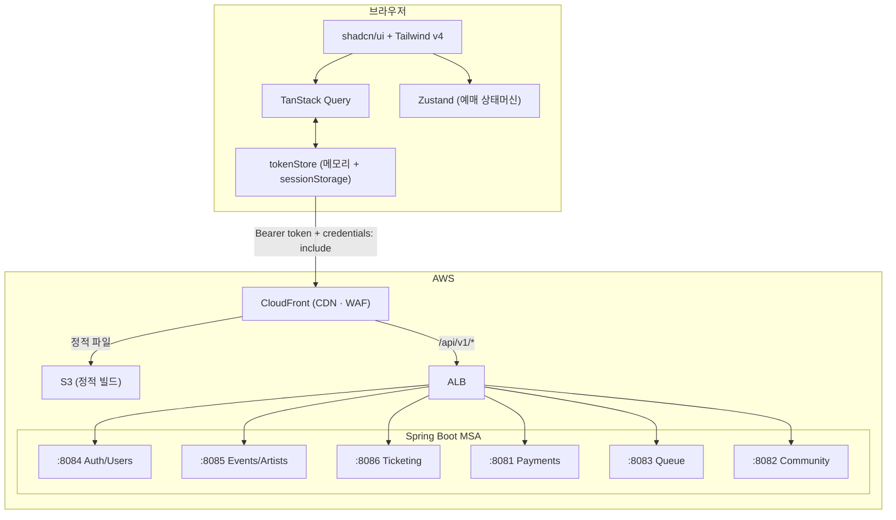

# URR (우르르)

> K-POP 찐팬을 위한 공정 티켓팅 플랫폼

**매크로·봇이 점령한 대기열** 문제를 해결하기 위해, 팬 활동 점수 기반 멤버십 등급으로 티켓 우선권을 차등 부여하는 공정 티켓팅 서비스입니다.  
티켓 예매 → 양도 → 팬 커뮤니티를 단일 플랫폼으로 통합합니다.

|                 |                                                                               |
| --------------- | ----------------------------------------------------------------------------- |
| 협업 레포지토리 | [KTCloud-TechUp/urr-frontend](https://github.com/KTCloud-TechUp/urr-frontend) |
| 포트폴리오 레포 | [kkaengji/urr-frontend](https://github.com/kkaengji/urr-frontend)             |
| 라이브 데모     | `배포 후 추가 예정`                                                           |

---

## 이 레포지토리에 대해

원래 **15명 팀 · 약 10주** 협업 프로젝트로, 프론트엔드(Next.js) + 백엔드(Spring Boot MSA) + 인프라(AWS EKS/S3/CloudFront)를 함께 운영했습니다.

| 협업 당시 규모 |                 |
| -------------- | --------------- |
| 연동 API       | 50개 엔드포인트 |
| 개발 페이지    | 10개 라우트     |

**포트폴리오 전환 시 변경 사항**

인프라 비용 문제로 백엔드 서버를 종료하고, 프론트엔드만 Vercel에 배포하는 구조로 전환했습니다.
협업 중 일정·합의 제약으로 미뤄뒀던 디자인·UX 개선도 함께 진행합니다.

- 주요 조회/예매/결제 데모 플로우 → mock 데이터로 전환 (TanStack Query 구조 유지)
- 로그인/회원가입 → mock 토큰·mock 유저 기반으로 전환
- 소셜 콜백, 문자 인증, 회원 탈퇴 등 일부 API 연동 코드는 재연동을 위해 유지
- 플로우가 끊겼던 부분 복원 및 UX 개선

---

## 핵심 요약

- **Next.js 16** 기반 티켓팅 플랫폼 프론트엔드 단독 개발 (Vite 프로토타입 → Next.js 마이그레이션 포함)
- 실시간 예매 플로우 및 상태머신 설계 (Zustand + sessionStorage 기반 페이지 이동 제어)
- JWT 인증 + 401 자동 재발급 인터셉터 구현 (httpOnly 쿠키 + 메모리 토큰)
- S3 정적 배포 환경에서 **OAuth 콜백 토큰 유실 문제** 발견 및 해결 (sessionStorage 백업)
- FSD(Feature-Sliced Design) 아키텍처로 AI 에이전트 병렬 개발 워크플로우 구성

---

## 목차

1. [기술 스택](#기술-스택)
2. [핵심 구현](#핵심-구현)
3. [아키텍처](#아키텍처)
4. [트러블슈팅](#트러블슈팅)
5. [화면 구성](#화면-구성)
6. [로컬 실행](#로컬-실행)
7. [회고](#회고)

---

## 기술 스택

| 분야         | 기술                    | 선택 이유                                           |
| ------------ | ----------------------- | --------------------------------------------------- |
| Framework    | Next.js 16 (App Router) | 서버-클라이언트 경계 명확화 + 파일 기반 중첩 라우팅 |
| Language     | TypeScript (strict)     | 도메인 타입 안전성                                  |
| Styling      | Tailwind CSS v4         | 디자인 토큰 기반 스타일링                           |
| UI           | shadcn/ui (Radix UI)    | 접근성 준수 + 커스터마이징 자유도                   |
| Server State | TanStack Query v5       | API 캐싱 / 비동기 상태 / 낙관적 업데이트            |
| Client State | Zustand                 | 예매 플로우의 페이지 간 상태머신 관리               |

### 기술 선택 이유

**Next.js** — App Router 기반 라우팅, 레이아웃 예외 처리, 결제 확인용 Route Handler처럼 화면과 서버 경계를 한 레포 안에서 관리하기 좋았습니다. 포트폴리오 전환 후에는 Vercel 배포와 mock 데이터 중심 구조에 맞춰 클라이언트 플로우의 완성도를 우선했습니다.

**TypeScript** — 결제·예약 같은 금융 거래에는 타입 안정성이 필수입니다. IDE에서 API 응답 구조를 자동 보완하므로 개발 속도도 빠릅니다. 특히 복잡한 좌석 데이터 구조를 다룰 때 타입 미스매치를 컴파일 단계에서 잡을 수 있습니다.

**TanStack Query** — 2-Panel 예매 구조에서는 공연 정보, 대기열 상태, 좌석 정보가 실시간으로 동기화되어야 합니다. 자동 refetch·폴링·낙관적 업데이트를 조합하면 Redux 같은 복잡한 상태 관리 없이도 백엔드 데이터를 항상 최신으로 유지할 수 있습니다.

**Zustand** — 최소한만 사용합니다. 예매 플로우처럼 여러 화면 단계와 URL 이동 사이에 유지되어야 하는 상태를 전역 store로 분리하고, 모달 열림/닫힘·탭 선택 같은 단순 UI 상태는 각 컴포넌트의 로컬 상태로 둡니다.

> **auth에 Zustand를 사용하지 않은 이유**: 인증 토큰은 React 렌더링 사이클 밖(API 인터셉터)에서도 읽어야 합니다. 이 프로젝트에서는 인터셉터가 직접 읽을 수 있도록 `tokenStore.ts`의 module-level 변수로 분리했습니다.

**Tailwind CSS + shadcn/ui** — Tailwind는 빠른 UI 구현을 가능하게 하고, shadcn/ui는 Radix UI 기반 컴포넌트로 접근성 구현의 출발점을 제공합니다. 대기열 모달·결제 다이얼로그처럼 상호작용이 많은 UI에서 기본 포커스 처리와 컴포넌트 일관성을 확보했습니다.

---

## 핵심 구현

### 예매 플로우 — 상태머신

```
idle → queue → seats-section → seats-individual → payment → confirmation
                                     ↓ 3분 타임아웃      ↘ payment-failed
                               seats-expired → seats-section 복귀
```

- **대기열**: 순번 대기 UI (3초 갱신, 현재 시뮬레이션). 멤버십 등급별 입장 시각 차등.
- **좌석 선택**: SVG 기반 인터랙티브 좌석도. 등급·가격·잔여 상태 색상 표시.
- **페이지 간 상태 보호**: sessionStorage 키(`urr:booking:startPhase`)로 예매 페이지 직접 URL 접근 차단. `BookingGuard`가 키 유효성 확인 후 `reset()` 호출.

### 인증 전략 — JWT + httpOnly 쿠키

```
Access Token  — JS 메모리 우선 + sessionStorage 백업 (S3 정적 배포 제약)
Refresh Token — httpOnly 쿠키 (JS 접근 불가, 브라우저 자동 전송)
```

- 모든 API 요청에 `Authorization: Bearer` 헤더 자동 주입
- 401 감지 → `POST /auth/token/reissue` → 성공 시 원본 요청 재시도 / 실패 시 로그아웃
- **sessionStorage 백업**: S3+CloudFront 환경에서 full page reload 시 JS 메모리 초기화 문제 대응. SSR 전환 시 제거 가능.

### Vite 프로토타입 → Next.js 마이그레이션

디자인팀 프로토타입(flat 구조, mock 데이터 혼재)을 FSD 아키텍처로 재구성했습니다.

| 항목         | Before          | After                    |
| ------------ | --------------- | ------------------------ |
| Framework    | React (Vite)    | Next.js 16 (App Router)  |
| Architecture | Flat 구조       | FSD (레이어 import 규칙) |
| State        | `useState` 중심 | TanStack Query + Zustand |

**핵심 원칙**: 디자인 1:1 유지. Tailwind 클래스·레이아웃·색상은 Next.js 문법(`Link`, `useRouter`, `public/` 경로)으로만 교체.  
**결과**: `features/<domain>/api/` 파일만 수정하면 mock → 실 API 전환 완료. FSD 단방향 import 규칙이 AI 에이전트 병렬 작업 시 코드 충돌 방지에 직접 기여.

---

## 아키텍처

### 협업 당시 시스템 구조



> 포트폴리오 버전은 주요 화면과 예매 데모 플로우를 Vercel + mock 데이터로 확인할 수 있게 전환했습니다.

### Feature-Sliced Design (FSD)

```
src/
├── app/        # Next.js 라우팅 진입점 (로직 없음)
├── widgets/    # 페이지 단위 UI 블록
├── features/   # 사용자 행동 단위 (feature 간 직접 import 금지)
├── entities/   # 도메인 모델
└── shared/     # api/, lib/, ui/
```

레이어 규칙: `app → widgets → features → entities → shared` 단방향만 허용.

```
features/<domain>/
├── ui/       # React 컴포넌트
├── model/    # Custom hooks · 상태 로직
├── api/      # API 요청 함수
└── index.ts  # public API
```

---

## 트러블슈팅

### 1. S3 정적 배포 — OAuth 콜백 토큰 유실 (403 에러)

**현상**: 카카오 소셜 로그인 완료 후 본인인증 API 요청이 403 반환. 로컬에서는 정상.

**원인**: OAuth 콜백 후 `/onboarding?step=identity`로 이동 시 CloudFront가 새 HTML 파일을 로드 → full page reload → JS 메모리 초기화 → 방금 저장한 Access Token 소멸.

**해결**: `tokenStore`에 sessionStorage 백업 계층 추가.

```ts
// tokenStore.ts
setToken: (token) => {
  accessToken = token;
  sessionStorage.setItem("at", token);  // page reload 대비
},

// 모듈 초기화 시 복원
let accessToken = typeof window !== "undefined"
  ? sessionStorage.getItem("at") : null;
```

**결과**: OAuth 콜백 후 페이지 전환 시에도 토큰 유지. 보안 트레이드오프(XSS 노출 면적 증가)는 Access Token 60분 수명 + Refresh Token httpOnly 보호로 허용 범위로 판단.

---

### 2. 예매하기 클릭 시 모달 깜빡임 후 상세 페이지 복귀

**현상**: 대기열 통과 후 예매 페이지로 이동하지 않고 이벤트 상세 페이지로 되돌아옴.

**원인**: `handleQueuePassed`에서 `resetBooking()` 호출이 `isLoading = true`로 바꾸는 순간, **이미 마운트된 이벤트 상세 페이지의** `BookingContext.useEffect`가 먼저 sessionStorage 키(`urr:booking:startPhase`)를 소비. 예매 페이지의 `BookingGuard`가 키를 찾지 못해 상세 페이지로 리다이렉트.

```
handleQueuePassed
  └─ sessionStorage.setItem("startPhase")
  └─ resetBooking()  ← isLoading: true
       └─ 이벤트 상세 페이지 useEffect 발동 → 키 소비
  └─ router.push("/booking")
       └─ BookingGuard: 키 없음 → router.replace("/events/:id") ← 루프
```

**해결**: `handleQueuePassed`에서 `resetBooking()` 제거. 대신 `BookingGuard`가 진입 허가 시점에 직접 `reset()` 호출.

**결과**: 이벤트 상세 페이지가 언마운트된 이후에 `reset()`이 호출되므로 키 가로채기 없이 예매 페이지 정상 진입.

> **교훈**: 전역 Zustand 스토어를 여러 페이지 Provider가 공유할 때, 상태 변경 부작용이 예상치 못한 페이지의 `useEffect`를 트리거할 수 있다. 페이지 이동용 초기화는 **이동 대상 페이지(Guard)**에서 처리.

---

## 화면 구성

| URL                              | 페이지                                  |
| -------------------------------- | --------------------------------------- |
| `/`                              | 홈 (히어로 · 인기 아티스트 · 공연 랭킹) |
| `/landing`                       | 서비스 소개 랜딩                        |
| `/artists` / `/artists/:id`      | 아티스트 목록 / 상세 (멤버십 게이트)    |
| `/events` / `/events/:id`        | 공연 목록 / 상세                        |
| `/events/:id/booking`            | 예매 플로우 (대기열 → 좌석 → 결제)      |
| `/booking/complete`              | 결제 완료                               |
| `/membership`                    | 멤버십 가입 (4단계)                     |
| `/my-page`                       | 티켓·멤버십·양도 내역                   |
| `/onboarding`                    | 소셜 OAuth + 이메일 가입                |
| `/search`                        | 아티스트·공연 검색                      |
| `/transfer/:artistId/:listingId` | 양도 상세                               |
| `/tickets/:reservationId`        | 티켓 상세                               |
| `/notifications`                 | 알림                                    |

스크린샷은 배포 화면 기준으로 정리 후 추가 예정입니다.

---

## 로컬 실행

```bash
npm install
npm run dev    # http://localhost:3000
npm run build  # 빌드 검증
```

주요 화면, 예매, 결제 데모 플로우는 mock 데이터로 동작하므로 별도 백엔드 서버 없이 확인할 수 있습니다. 다만 `.env.local`은 로컬 백엔드 연동용 URL을 포함하고 있고, 소셜 콜백·문자 인증·회원 탈퇴처럼 재연동을 위해 남겨둔 일부 API 코드는 실제 서버가 없으면 정상 동작하지 않습니다.

---

## 회고

### 잘 된 것

| 항목               | 회고                                                                                                                                                                                                                                                            |
| ------------------ | --------------------------------------------------------------------------------------------------------------------------------------------------------------------------------------------------------------------------------------------------------------- |
| FSD 구조 정리      | `app → widgets → features → entities → shared` 흐름을 강제하면서 페이지, 도메인 로직, 공용 UI의 책임이 분리되었습니다. mock 데이터로 전환할 때도 `features/<domain>/api/` 경계 안에서 작업이 끝나 영향 범위를 좁힐 수 있었습니다.                               |
| 예매 플로우 안정화 | 대기열, 좌석 선택, 결제, 완료 화면이 여러 단계로 이어지는 구조라 단순 `useState`만으로는 흐름이 쉽게 깨졌습니다. Zustand store와 `BookingGuard`를 분리한 뒤에는 직접 URL 접근, 새로고침, 이전 페이지의 effect 간섭 같은 케이스를 명확하게 제어할 수 있었습니다. |
| 포트폴리오 전환    | 백엔드가 내려간 뒤에도 프로젝트를 단순 스크린샷이 아니라 실제로 눌러볼 수 있는 데모로 유지했습니다. 조회/예매/결제 흐름은 mock으로 살리고, 재연동 가능성이 있는 API 클라이언트와 인증 인터셉터는 보존했습니다.                                                  |

### 아쉬운 것

| 항목                             | 원인                                                                                                     | 다음에는                                                                                                                     |
| -------------------------------- | -------------------------------------------------------------------------------------------------------- | ---------------------------------------------------------------------------------------------------------------------------- |
| 실 API와 mock 경계가 늦게 분리됨 | 협업 중에는 API 연동 속도가 우선이라 mock 전환을 별도 계층으로 미리 설계하지 못했습니다.                 | 초기부터 `api` 함수의 반환 타입과 mock fixture를 같은 계약으로 묶어, 서버 유무와 무관하게 화면 검증이 가능하게 만들겠습니다. |
| 인증 설명과 실제 구현의 간극     | 협업 버전의 JWT/httpOnly 쿠키 설계와 포트폴리오 버전의 mock 로그인 구조가 README에 함께 남아 있었습니다. | README에는 현재 실행 가능한 상태를 먼저 쓰고, 과거 협업 인프라나 JWT 설계는 별도 섹션에서 명확히 구분하겠습니다.             |
| 예매 상태 설계가 후반에 정리됨   | UI를 먼저 붙인 뒤 상태머신을 정리하면서 Provider, guard, sessionStorage 사이의 책임이 한 번 꼬였습니다.  | 여러 라우트에 걸치는 플로우는 화면 구현 전에 상태 전이표와 진입 조건부터 정의하겠습니다.                                     |

---

## 관련 문서

| 문서                     | 내용                                   |
| ------------------------ | -------------------------------------- |
| [`CLAUDE.md`](CLAUDE.md) | AI 에이전트용 프로젝트 컨텍스트 가이드 |
